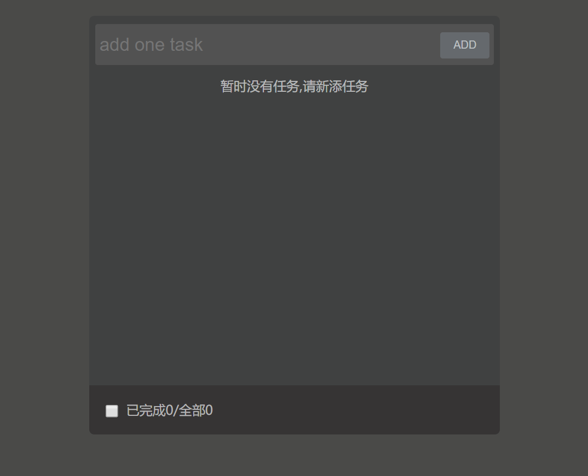
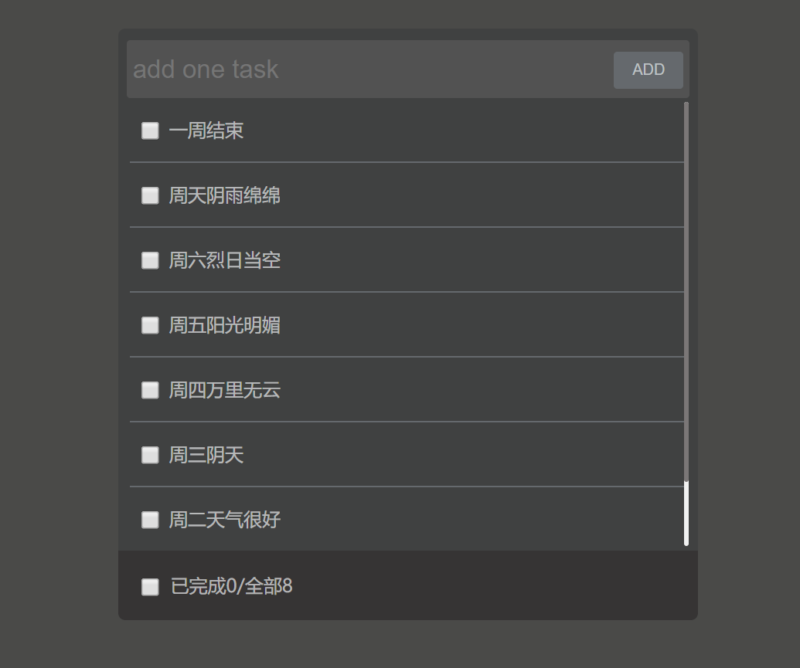
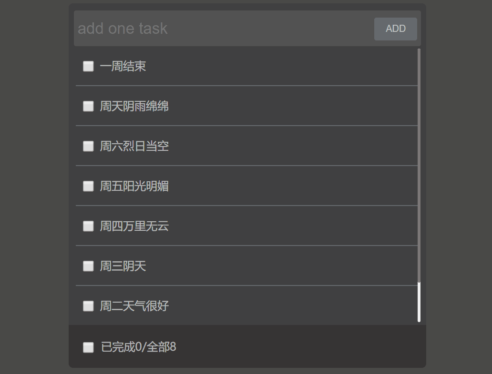
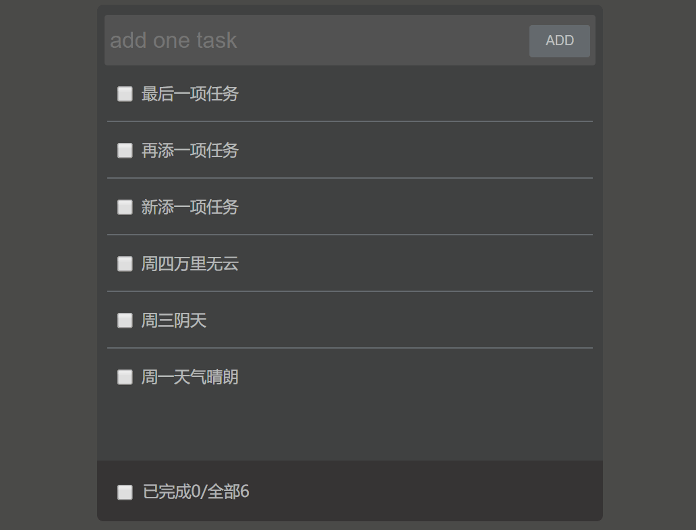
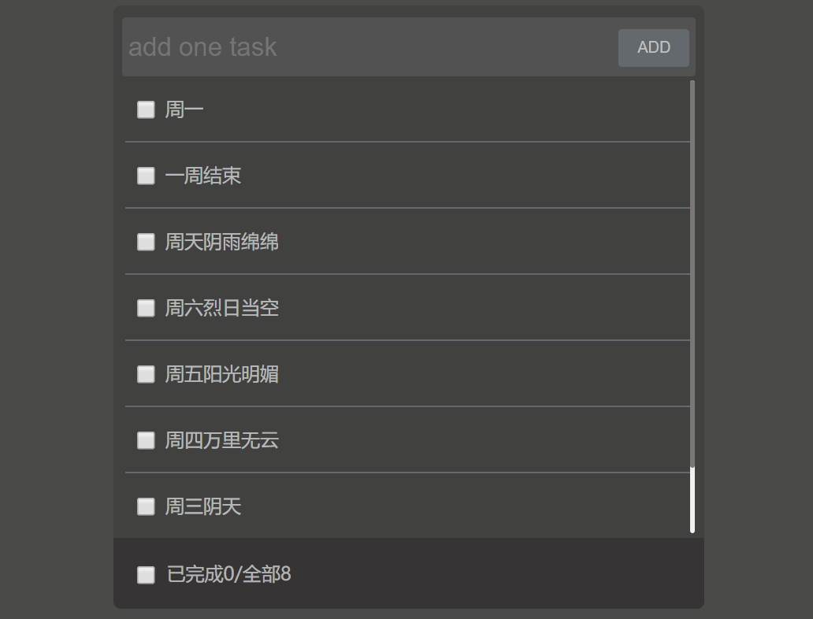

### ToDoList

-----

### 使用工具：
前端： vue-cli3 + vuex + axios + pubsub-js

后端： nodeJS + express

数据库： mongodb + mongoose

### 思路

前后端分离，前端负责搭建todolist页面，由于只有一个小页面，没必要使用同在vue全家桶中的vue-router；使用vuex管理各组件共同使用的数据，使用promise简单封装了下ajax请求，其中使用了axios工具发ajax请求，在vue.config.js配置文件中配置相关参数解决跨域请求问题；后端使用express搭建了一个极为简单的本地服务器，管理相应的后端路由；在服务器中使用mongoose工具包操作mongodb数据库。

### 项目效果





### 实现的功能

#### 添加任务



#### 删除单个任务



#### 删除多个任务



#### 全选


### 项目下载方式

```
git clone https://github.com/Yeahnow/todolist-vue.git
```

或者直接下载压缩包

### 项目运行步骤

首先确保你安装了mongodb数据库！！并通过cmd命令行窗口打开数据库服务

其次先运行服务器，进入todolistServer文件夹在命令行中输入以下指令开启服务器

```
npm install
```

```
node app.js
```

最后进入todolist文件夹在命令行中输入以下指令

```
npm install
```

```
npm run serve
```

之后会浏览器会自动打开项目页面


